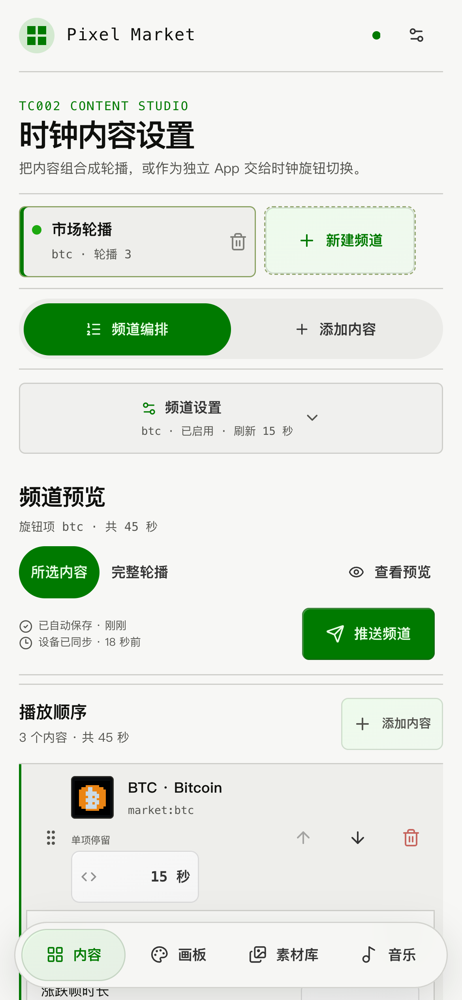
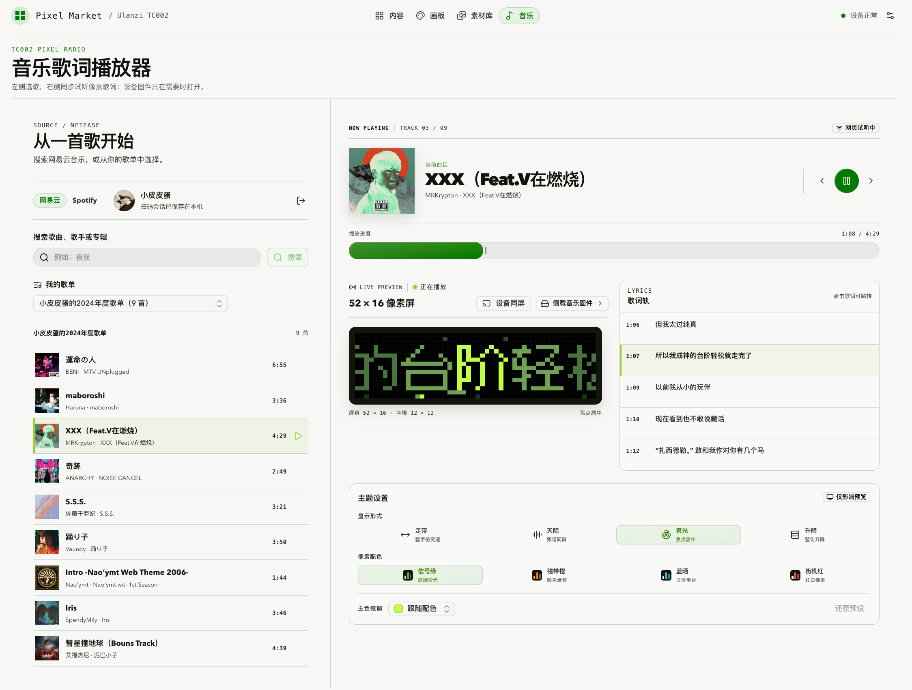
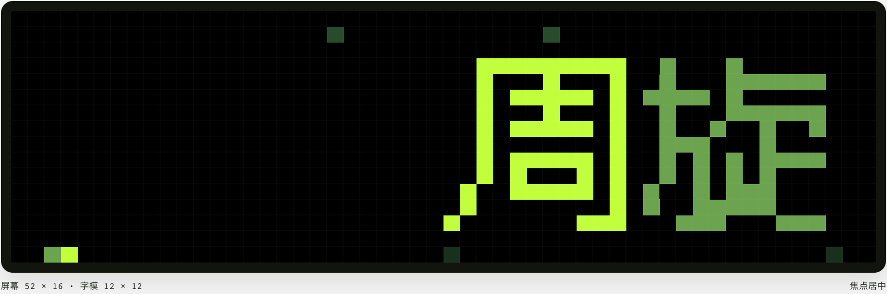

# Ulanzi TC002 Pixel Studio

[English](README.en.md) | 简体中文

把 Ulanzi TC002 像素时钟（52×16 LED）变成一个可扩展的多频道内容工作台：行情、通知、
计时器、像素动画、画板创作、官方社区素材，再加一个完整的音乐歌词播放器。所有内容都在
浏览器里编排，由本机 Bun 服务渲染成像素帧并推送到时钟。


## 基本概念：频道与内容项

- **频道 = 时钟上的一个 Custom App**，可以直接用 TC002 旋钮切换。
- **内容项 = 频道里的一段内容**。只有一项时是独立画面；多项会自动合成按序播放的 GIF 轮播。

比如三个旋钮项目：`markets`（BTC → 黄金 → AAPL 轮播）、`timer`（计时柱）、`fire`（火焰动画）。

## 内容一览

| 分类 | 内容 |
| --- | --- |
| 市场 | 内置 BTC、ETH、BNB、SOL、黄金、USD/CNY、AAPL、MSFT、NVDA、GOOGL；另可搜索添加更多资产（见下节） |
| 工具 | 通知板、计时柱 |
| 视觉 | 兰顿蚂蚁、鱼缸、火焰、翻页钟、数字雨时钟、走迷宫、像素宠物、落沙、星空穿梭 |
| 创作 | 52×16 画板；从素材库导入的 Ulanzi 官方社区像素素材（PNG / GIF） |

### 市场：搜索添加任意资产（免 key）

内容市场里的「搜索更多资产」支持四类资产，全部走公开接口，无需申请任何 API key：

| 类型 | 来源 | 说明 |
| --- | --- | --- |
| 数字货币 | Coinbase Exchange 公开目录与行情 | 任意可交易产品，24H 涨跌 |
| 股票 / ETF | Yahoo Finance 公开搜索 + Chart 接口 | 美股、港股、A 股、日欧等主要交易所；价格可能延迟，1D 涨跌 |
| 汇率 | Frankfurter（ECB 参考汇率） | 任意 ISO 货币对，央行日参考价而非逐笔报价 |
| 金属 | Gold API | 金、银、铂、钯现货 |

股票搜索只放行报价币种无歧义的交易所（伦敦便士报价、OTC 粉单不出现在结果里），报价端还会
核对实际上市币种，不符即报错，绝不把价格标成错误币种。添加后的资产保存为本地稳定身份；报价
失败时先沿用缓存旧价，缓存过期后跳过该项，频道其余内容不受影响。

图标自动生成：数字货币若能在打包的 CC0 目录（`cryptocurrency-icons@0.18.1`）中通过
符号 + 归一化名称双重匹配，就离线确定性像素化成 16×16 品牌图；匹配不确定或其他资产类型
一律使用按身份生成的程序化像素标识，绝不猜图。内置四只美股沿用 PixDeck 原始图标，来源与
哈希见 [THIRD_PARTY_NOTICES.md](THIRD_PARTY_NOTICES.md)。

### 画板与素材库

画板支持画笔、橡皮、自定义颜色、网格、撤销/重做、ASCII 像素文字、图片像素化和 PNG 导出；
保存的画布就是普通内容项，既能加入轮播也能独立成旋钮项目。

素材库直连 Ulanzi 官方社区（每次浏览、搜索、翻页都实时请求官方接口，上游增删随时可见），
也可粘贴 `ugc.ulanzistudio.com/contentView/...` 链接导入。导入素材会最近邻还原到 52×16、
保留 GIF 帧时序，快照存于本机 `.runtime/pixel-assets`——之后预览和推送不依赖官方站点在线，
也不会被上游改动静默替换。社区作品不随本仓库分发，界面保留作者与来源。

## 快速上手

`mise.toml` 固定 Bun 1.3.14：

```bash
mise install
mise run test && mise run typecheck && mise run build
CLOCK_HOST=TC002_IP bun start        # TC002_IP 换成时钟的局域网 IP 或主机名
```

然后打开 `http://127.0.0.1:43820/`。不用 mise 时直接 `bun install && bun test && bun run build`；
`bun run preview` 把各频道预览图生成到 `.runtime/previews/`，`bun run status` 查看服务状态。

安装为常驻服务（二选一，勿同时占用同一个 43820 端口）：

```bash
bash scripts/install.sh --host TC002_IP          # macOS LaunchAgent
bash scripts/install-docker.sh --host TC002_IP   # Docker Compose（仅发布到宿主机回环）
```

macOS 安装默认监听 `0.0.0.0`，方便同局域网手机访问（常规设置 → 标题栏手机图标可扫码/复制
地址）；传 `--control-host 127.0.0.1` 则只留本机。

| 环境变量 | 默认值 | 说明 |
| --- | --- | --- |
| `CLOCK_HOST` | 无，必填 | TC002 的局域网 IP 或主机名，不带协议和端口 |
| `CONTROL_HOST` | macOS 安装为 `0.0.0.0`；直接运行为 `127.0.0.1` | 控制台监听地址；手机访问需要 `0.0.0.0` |
| `HEALTH_PORT` | `43820` | 控制台、API 和健康检查端口 |
| `REQUEST_TIMEOUT_MS` | `5000` | 行情和设备请求超时 |
| `SOURCE_STALE_MS` | `120000` | 行情失败时允许复用缓存的时间 |
| `DISPLAY_DURATION_SECONDS` | `90` | Custom App 在设备上的最短有效时间 |
| `APP_NAME` | `btc` | 全新安装或旧配置首次迁移时的默认频道名 |
| `ADB_BIN` | 安装时自动检测 | `adb` 的绝对路径；LaunchAgent 不继承终端 PATH |
| `CLOCK_HTTP_PROXY` | 无 | 可选，设备请求走的回环 HTTP 代理（不带凭据） |

## 控制台

- 左侧频道列表（对应旋钮）、中间频道编辑器（排序、时长、预览、单独推送）、右侧按
  「市场 / 工具 / 视觉 / 创作」分组的内容市场。
- 顶部四个一级视图：**内容 / 画板 / 素材库 / 音乐**。
- 右上角「常规设置」直接读写时钟的亮度、音量、翻页、滚动、时区、日期、星期与低电量休眠；
  标题栏手机图标按需展开同网段二维码与地址。

手机竖屏把「频道编排」和「添加内容」拆成两个工作区，底部导航与单列表单针对触控重排，
画板会提示横屏使用。页面自带 Web App Manifest 与离线静态壳，可「添加到主屏幕」；完整
PWA 安装需要可信 HTTPS，纯局域网 HTTP 下响应式控制台不受影响。

<p align="center">
  
</p>

设置保存在 `.runtime/workspace.json`；旧版 `.runtime/settings.json` 首次启动时原子迁移为
一个市场频道，原文件不覆盖。禁用、删除频道或修改 `appName` 时，服务向旧 Custom App 名
发送空对象清理；设备离线导致清理失败只记录为降级状态，不回滚已保存的工作区。

## 音乐歌词播放器



顶部「音乐」是一个完整的音乐工作台：**网易云音乐**与 **Spotify** 两个音源随时切换，
搜索（20 首/页）、歌单、逐行歌词（含翻译）和 52×16 像素歌词实时预览是共用的。
当前音源记在 `.runtime/music-provider.json`，重启后保持不变；切换会清空上一个音源的
选曲——两边的曲目 ID 互不通用。

- **网易云**：扫码登录，音频走同源代理，TC002 自己下载并用扬声器播放。登录 Cookie 只存
  本机 `.runtime/music-session.json`（权限 `0600`），浏览器和时钟都拿不到原始凭据，
  登出即删除；歌曲能否播放仍受账号、会员、版权和地区限制。
- **Spotify**：走官方 Spotify Connect。音频不落地到本机或时钟——播放发生在你选中的
  Connect 设备（手机、桌面客户端、音箱）上，工作台和 TC002 都是遥控器加歌词屏。

### Spotify Connect 接入

Spotify 不发放公共密钥，需要你在自己的开发者后台建一个免费应用（一次性，两分钟）：

1. 打开 [Spotify 开发者后台](https://developer.spotify.com/dashboard) → Create app
2. Redirect URI 精确填 `http://127.0.0.1:43820/api/music/spotify/callback`
   （端口跟随 `HEALTH_PORT`；Spotify 只接受回环地址作为明文 http 回调，`localhost` 已不再受理）
3. 勾选 **Web API**，保存后把 Client ID 粘进工作台的 Spotify 面板

授权用 **Authorization Code + PKCE**，因此不需要也不会存 Client Secret；刷新令牌写在
`.runtime/spotify-session.json`（权限 `0600`），登出即删除。回调只能落到运行服务的这台
机器，所以用手机或平板打开工作台时，把浏览器地址栏里那条打不开的 `127.0.0.1` 链接粘回
面板即可完成登录。

接上之后：搜索、歌单（含「喜欢的音乐」）、选歌播放、暂停、上一首/下一首、拖动进度、
切换 Connect 播放设备、调音量全部走 Web API；**反过来也成立**——在手机上换一首歌，
时钟和工作台会在两秒内跟上，歌词自动切换。Connect 的播放控制需要 Premium 账号，
免费账号会收到明确提示而不是一个静默失败。Spotify 没有公开歌词接口，歌词来自
[LRCLIB](https://lrclib.net)（免 key），中文歌再回落到网易云的逐行歌词。

播放本身留在你自己的 Spotify 客户端里 —— 工作台不做网页播放器。这不是能力缺口而是取舍：
浏览器播放要引入 Spotify CDN 的第三方脚本、放宽页面 CSP、并把访问令牌交到前端，而你电脑上
本来就开着客户端，用它选歌更快，状态还是双向同步的。

预览与设备共用同一套主题系统：四种显示形式（走带 / 天际 / 聚光 / 升降）× 四套配色
（信号绿 / 磁带橙 / 蓝晒 / 街机红），另可用取色器覆盖自定义主色。字模也是同一份：
网页不在运行期光栅化网页字体，而是直接读固件那套离线生成的 12×12 中日文 / 6×12
半宽 ASCII 点阵表，所以预览、推给官方固件的帧、原生固件三者逐像素一致。

两条互补的上屏路径：

- **设备同屏（官方固件，不刷机）**：把渲染好的歌词帧（≤60 帧、约 15fps）推到官方固件的
  Custom App 通道显示；声音由浏览器播放。
- **原生音乐固件（非持久化侧载）**：仓库内含完整的 FlyThings C++ 播放器（Docker 交叉
  编译，无需 Windows IDE），在网页上一键侧载——服务地址会在侧载时自动写入设备，
  换网络、换机器都无需重新编译。同一个固件按音源自动切换两种工作方式：网易云下
  载音频本地播放；Spotify 下不下载任何音频，改为跟随服务端上报的 Connect 播放位置
  （漂移超过 0.9 秒才校正，中间由本地 60ms 时钟补帧），左右键变成上一首/下一首，
  旋钮直接调 Connect 设备音量。固件在真机上下载音频、扬声器播放、毫秒级进度跳转，
  用离线光栅化的 12×12 中日文字模直接驱动 LED，并自带六秒开机动画与「选择歌曲」
  待机画面。网页与固件通过控制序列 + 心跳协议**双向实时同步**：网页选歌/暂停/换主题/
  拖进度 2 秒内落到设备，设备按键即时回流，预览动画锚定真机播放头。固件上线数秒内
  工作台自动切换为遥控模式，并锁定内容/画板/素材库与常规设置（它们走官方固件通道，
  直连期间不可用），恢复官方固件后自动解锁。官方固件没有能解码网络音频的播放器，
  扬声器出声必须由设备端应用调用 `AudioManager`——这正是侧载固件存在的原因
  （MQTT 只能传控制消息，替代不了它）。

<p align="center">
  
</p>

侧载始终是非持久化的：固件只推进设备内存盘临时运行，点「恢复官方固件」或断电重启即回到
原样，flash 从不被写入。侧载前需三重确认：固件包逐文件 SHA-256 与发布清单一致、官方
HTTP 接口与 Wi-Fi ADB 双重确认真机、用户勾选已知恢复方式。固件源码、协议、构建与
部署详见 [device/tc002-lyrics-player](device/tc002-lyrics-player/README.md)。

## 架构与扩展

内容渲染器只产生 52×16 帧和延时，不允许写设备或自建后台循环；统一控制器负责行情缓存、
帧数上限、GIF 编码、串行设备写入、失败隔离和刷新调度（决策见
[ADR 0001](docs/adr/0001-extensible-content-channels.md)）。新增可信内置内容就是在
`src/content-registry.ts` 注册一个 `ContentDefinition`；注册表故意不动态加载任意第三方
JavaScript，不受信任的插件应走独立进程协议并另写 ADR。

设备传输当前使用 TC002 原生的 `POST /api/custom?name=...`（无需 Broker，一次请求就是一个
完整 Custom App，删除旧项目语义明确），并通过注入的 `pushPayload(appName, payload)` 与内容
框架解耦——将来接 Home Assistant 或 MQTT 总线只需新增传输适配器，不改任何渲染器。音乐的
架构边界（网页 / 服务端 / 固件各自负责什么）见
[ADR 0002](docs/adr/0002-native-music-player-boundary.md)。

## 本地 API

| 方法 | 路径 | 用途 |
| --- | --- | --- |
| `GET` | `/api/catalog` | 内容分类、选项定义和默认值 |
| `GET` / `PUT` | `/api/workspace` | 读取或原子保存全部频道 |
| `POST` | `/api/channels/preview` | 预览已保存频道或未保存的频道草稿 |
| `POST` | `/api/channels/push` | 推送一个频道 |
| `POST` | `/api/push` | 推送全部启用频道 |
| `GET` | `/api/state`、`/health` | 设备、频道、行情和清理状态 |
| `GET` / `PUT` | `/api/device/settings/general` | 读取或写入 TC002 常规设置 |
| `GET` | `/api/access` | 返回同网段手机访问地址和监听状态 |
| `GET` | `/api/market/search` | 按关键词与类型搜索可添加的市场资产 |
| `GET` / `POST` | `/api/market/instruments` | 列出已添加资产；按候选引用注册新资产 |
| `GET` | `/api/market/icons/:iconRef.png` | 运行时资产的 16×16 像素图标（不可变缓存） |
| `GET` | `/api/presets`、`/api/icons/:id.png` | 兼容旧客户端的市场预设与内置资产图标 |
| `GET` / `PUT` | `/api/settings` | 兼容旧版单市场轮播设置 |
| `POST` | `/api/preview` | 兼容旧版：直接返回渲染的 GIF/PNG 字节 |
| `GET` | `/api/library/ulanzi/pixel-assets` | 查询官方社区素材、分类、搜索和分页 |
| `GET` | `/api/library/ulanzi/media` | 安全代理官方素材缩略图 |
| `POST` | `/api/library/ulanzi/import` | 校验并导入官方 `contentView` 链接或作品 ID |
| `GET` | `/api/library/ulanzi/imported/:ref` | 读取已归一化的本地素材快照 |
| `GET` / `POST` | `/api/music/providers`、`/api/music/provider` | 列出两个音源及其登录状态；切换当前音源 |
| `GET` | `/api/music/session`、`/api/music/avatar` | 当前音源的脱敏登录状态与头像代理 |
| `POST` | `/api/music/qr`、`/api/music/qr/check`、`/api/music/logout` | 网易云服务端二维码会话；登出并删除本机凭据 |
| `GET` / `PUT` | `/api/music/spotify/app` | 读取或保存 Spotify 应用 Client ID（PKCE，无 Secret） |
| `POST` | `/api/music/spotify/login`、`/api/music/spotify/complete` | 生成 PKCE 授权链接；用粘回的回调链接完成登录 |
| `GET` | `/api/music/spotify/callback` | Spotify 授权回调（自包含结果页，校验 state） |
| `GET` | `/api/music/spotify/devices` | 列出可用的 Spotify Connect 播放设备 |
| `POST` | `/api/music/remote` | Connect 播放控制：播放/暂停/上下曲/seek/音量/转移设备 |
| `GET` | `/api/music/search`、`/api/music/playlists`、`/api/music/playlists/:id/tracks` | 按当前音源搜索歌曲、读取歌单及曲目 |
| `GET` | `/api/music/tracks/:id`、`/api/music/tracks/:id/stream` | 歌曲信息与逐行歌词；同源音频代理（支持 Range，仅网易云） |
| `GET` / `POST` | `/api/music/device-app/*` | 校验固件包、检测真机、侧载固件与恢复官方固件（内存盘会话） |
| `POST` / `DELETE` | `/api/music/mirror` | 把歌词帧（≤60）推到官方固件 Custom App（设备同屏） |
| `POST` | `/api/music/device/select`、`/api/music/device/control` | 网页下发选歌与控制补丁（播放/主题/配色/主色/seek） |
| `GET` | `/api/music/device/state`、`/api/music/device/current` | 音乐固件轮询的纯文本控制状态；兼容的轻量当前曲目查询 |
| `POST` | `/api/music/device/report`、`/api/music/device/heartbeat` | 固件上报按键动作与播放头心跳 |
| `GET` | `/api/music/device/now`、`/api/music/device/audio` | 固件读取当前曲目歌词与下载音频 |

写接口仅接受 JSON 并执行同源检查（设备上报的 `report` / `heartbeat` 除外，它们的调用方是
时钟固件）；请求体上限 256 KiB。工作区最多 24 个频道、每频道 48 项、
每频道最多渲染 360 帧；App 名唯一且限 1–32 个 ASCII 字母、数字、下划线或连字符。

## 数据来源与许可

内置 10 资产：加密货币走 Coinbase（Kraken 备用，24H 变化）；黄金用 Gold API（免费接口无
可靠 24H 开盘字段，不伪造涨跌）；USD/CNY 为 Frankfurter/ECB 日参考汇率；四只美股用 Yahoo
Chart（1D 前收盘变化）。搜索添加的运行时资产每类固定单一来源（Coinbase / Yahoo /
Frankfurter / Gold API，无备用路由），报价失败即降级显示。

音乐音源：网易云音乐（非官方接口，凭据只存本机）、Spotify Web API + Spotify Connect
（官方接口，需你自己的开发者应用；Connect 控制需 Premium）。歌词来自各音源自带的
逐行歌词与 [LRCLIB](https://lrclib.net) 社区库。本项目与网易云、Spotify、Ulanzi 均无
从属或背书关系；Spotify 音频受 DRM 保护，本项目从不下载、代理或转码它。

本项目因迁移和修改 GPL‑3.0 的 PixDeck 内容而采用 **GPL‑3.0-only**。分发源码或二进制前请
阅读 [LICENSE](LICENSE) 和 [THIRD_PARTY_NOTICES.md](THIRD_PARTY_NOTICES.md)。
