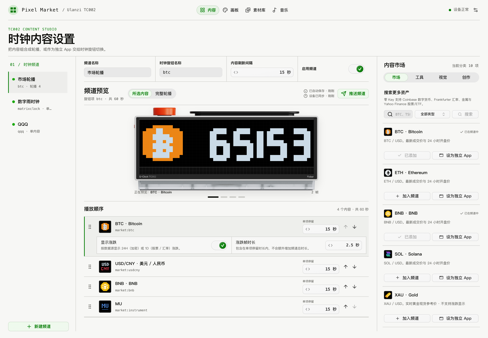
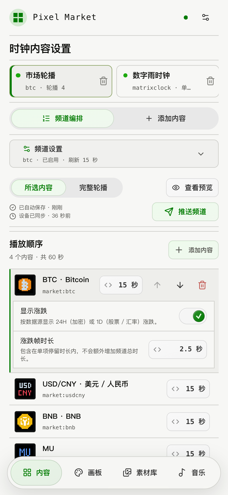
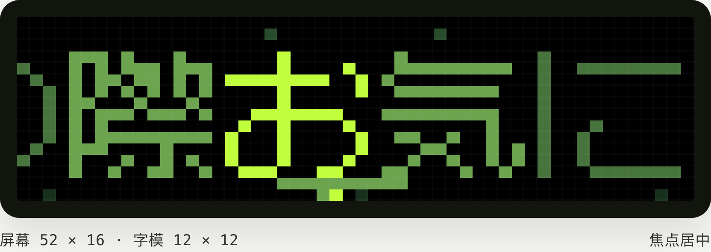

# Ulanzi TC002 Pixel Studio

[English](README.en.md) | 简体中文

把 Ulanzi TC002 像素时钟（52×16 LED）变成一个多频道内容工作台：行情、通知、计时器、
像素动画、画板、社区素材，再加一个音乐歌词播放器。内容在浏览器里编排，本机的 Bun 服务
渲染成像素帧推到时钟。



## 能做什么

- **频道**：一个频道就是时钟上的一页，用旋钮切换；一个频道里放多项内容就自动轮播。
- **市场**：内置 BTC、黄金、AAPL 等资产，可搜索添加任意数字货币、股票 / ETF、汇率和贵金属，不用 API key。
- **工具**：通知板（curl / iOS 快捷指令 / Home Assistant 一个 POST 就能上屏）、计时柱、番茄钟、倒数日。
- **视觉**：二十多种像素动画与钟面——鱼缸、火焰、翻页钟、像素宠物、生命游戏、烟花、彩虹猫、天气钟、日出日落色温钟等。
- **创作**：52×16 画板、图片像素化、扫码协作涂鸦；导入 Ulanzi 社区素材（PNG / GIF）或本地视频。
- **音乐**：网易云与 Spotify 双音源，卡拉 OK 式逐字高亮歌词，52×16 实时预览，四种显示形式 × 四套配色。
- **游戏**：打砖块、像素小鸟、贪吃蛇、双人 Pong、赛车、太空射击、俄罗斯方块，浏览器里玩、画面实时上屏；双人 Pong 可以扫码用手机当手柄。
- **VIBE**：把 Claude Code、Codex 等 AI 编码代理的额度显示到时钟上（需要 ZOS，见下文）。

时钟的亮度、音量、时区等设置在控制台右上角直接改。手机浏览器有专门的触控布局，可以添加到主屏幕。

<p align="center">
  
</p>

## 快速安装

需要 [Bun](https://bun.sh)（`mise.toml` 已固定版本，用 mise 则 `mise install` 即可）：

```bash
bun install
CLOCK_HOST=TC002_IP bun start        # TC002_IP 换成时钟的局域网 IP 或主机名
```

然后打开 `http://127.0.0.1:43820/`。安装为常驻服务（二选一）：

```bash
bash scripts/install.sh --host TC002_IP          # macOS LaunchAgent
bash scripts/install-docker.sh --host TC002_IP   # Docker Compose
```

## 音乐


- **网易云**：扫码登录即可搜索、播放，歌词带翻译。
- **Spotify**：走 Spotify Connect，播放发生在你选中的设备上，工作台和时钟是遥控器加歌词屏。需要在 Spotify 开发者后台建一个免费应用，控制台里有步骤。

歌词不刷机也能推到官方固件上同屏显示。想让时钟自己出声，用下面的 ZOS。

<p align="center">
  
</p>

## ZOS 系统固件

仓库自带一套替换官方 app 的固件（`device/tc002-os/`）。刷上以后时钟有自己的旋钮菜单：
**音乐 / 游戏 / 轮播 / VIBE / 设置**——轮播是控制台里的频道，游戏是同样七款的原生版，
音乐页显示当前曲目与歌词，设置里可以配网、调音量亮度。控制台能实时镜像面板画面、远程按键、
设置夜间息屏、在线升级固件。

设置 → 音乐播放 切到「时钟」后，网易云由时钟自己下载并从喇叭播放（尚未在真机验证，默认关）。

不想刷机也可以侧载：只进内存，断电即回官方固件。构建、侧载与刷写方法见
[device/tc002-os/README.md](device/tc002-os/README.md)。

VIBE 的数值读的是本机各家 CLI 的登录，不用填 API key。服务不在有登录的那台机器上时，
在那台机器上跑 `bun run agent` 推送过来，控制台 VIBE 页有向导。

## 许可

本项目因迁移和修改 GPL‑3.0 的 PixDeck 内容而采用 **GPL‑3.0-only**。分发源码或二进制前请
阅读 [LICENSE](LICENSE) 和 [THIRD_PARTY_NOTICES.md](THIRD_PARTY_NOTICES.md)。
