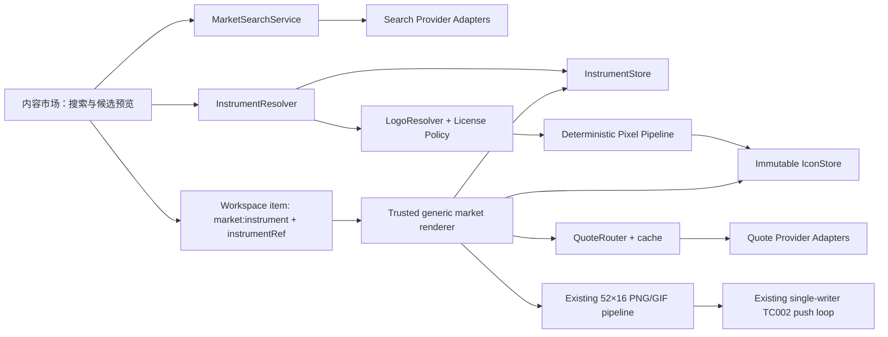

# 通用资产搜索与像素 Logo 实现方案

状态：研究完成，方案待确认；本轮不实现代码  
日期：2026-08-07  
范围：股票、数字货币、汇率、金属；Ulanzi TC002 的 52×16 内容频道

## 1. 结论

可以把当前固定的 10 个市场资产扩展成“用户搜索并添加运行时资产”，也可以把合规来源的 Logo 稳定转换为 16×16 像素图。但产品承诺需要改写为：

> 任何被已配置行情源支持、且身份可以唯一确认的资产，都能被添加并获得稳定、可读的类别/代码视觉；正确的品牌 Logo 是尽力而为的增强，不是添加资产的前置条件。

fallback 图标本身不承诺全局唯一或单独可识别品牌；唯一身份由图标旁文字、市场/报价币种和 instrument metadata 共同表达。

不能承诺“任意 ticker 都能找到正确 Logo，并且一次自动缩小就有稳定质量”。原因不是单一算法不够好，而是四个问题同时存在：

1. 同一个 ticker 可能对应不同交易所、证券或币种；先搜图再确认身份会配错 Logo。
2. 搜索覆盖、报价覆盖、Logo 覆盖是三个不同集合。
3. FX 和现货金属通常没有公司意义上的官方 Logo。
4. 16×16 图标经常需要删细节、加粗和光学居中，机械缩放无法稳定完成。

已选视觉的解析优先级应为：

1. 用户私有覆盖：用户选择、上传或逐像素修订的版本，永不被自动刷新覆盖。
2. 项目审核过的像素母版：保留当前 BTC、ETH、AAPL 等内置图标。
3. 用户已确认、来源可信、许可允许持久化，并通过质量门控的自动转换 Logo。
4. 确定性语义 fallback：股票代码、币种代码、FX 双代码、金属元素/品种代码。

候选来源的展示排序可以是 curated、合规 provider/Commons、用户上传、fallback；但一旦用户确认了 override，就不能再被 curated 或自动候选抢占。

因此，第一阶段应该先实现运行时资产模型、搜索/报价适配层和程序化 fallback，再接远程 Logo。Logo 获取失败不能阻塞添加、预览或推送。

## 2. 当前实现与缺口

### 2.1 资产不是运行时模型

- `src/assets.ts` 用联合类型固定了 `btc/eth/bnb/sol/gold/usdcny/aapl/msft/nvda/googl` 十项资产。
- `src/price.ts` 按固定 `AssetId` 路由 Coinbase、Kraken、Gold API、Frankfurter 和 Yahoo Chart。
- `src/content-registry.ts` 在启动时为每项资产注册一个静态 `market:<assetId>` 内容定义。
- Workspace 保存时必须命中静态内容定义，不能加入运行时出现的新 ticker。
- 当前内容市场只过滤本地 catalog；已有搜索仅用于 Ulanzi 社区素材，不是金融资产搜索。

因此继续往 `ASSET_IDS` 追加枚举不是通用方案，也会让行情、Logo、accent、API 和测试继续增长条件分支。

### 2.2 当前 Logo 有三种固定路径

- BTC、ETH、BNB、SOL、黄金和 USD/CNY 由 `src/pixel-ui.ts` 手绘 mask/文字。
- AAPL、MSFT、NVDA、GOOGL 使用 `src/stock-icons.ts` 中固定的 16×16 数据，并在 `THIRD_PARTY_NOTICES.md` 记录来源。
- `/api/icons/:id.png` 只接受固定 `AssetId`，并在进程启动时一次性生成内存 Map。

这些手工图标应保留为最高质量 override，而不是在通用化时重新跑自动转换。

### 2.3 浏览器像素化工具不能直接成为 Logo 生产管线

`web/src/lib/canvas-pixelize.ts` 适合交互式素材导入，但存在几处会直接损伤 Logo 的行为：

- 把透明像素和所有接近白色的像素都当作背景，会误删白色品牌标、稳定币细节和金属高光。
- `nearest` 与 `smooth` 当前都只是取采样块中心点，没有真正的覆盖率缩小。
- 调色板匹配是 sRGB 欧氏距离，没有 linear-light、premultiplied alpha 或感知色差处理。
- 测试只覆盖简单纯色/透明输入，没有真实 Logo、复杂背景、恶意 SVG 或跨平台 golden。

服务端必须成为最终像素结果的事实来源；浏览器只负责候选预览和人工调整。

### 2.4 52×16 会放大通用资产问题

- Logo tile 只有 16×16，通常应把主体控制在 12–14px，并留至少 1px 安全边。
- 当前价格过长时会直接隐藏图标。
- 固定小数位不足以展示超低价 token、高价证券、不同报价币种和不同 tick size。
- accent color 仍按固定 `AssetId` 分支。

因此通用资产不只是增加搜索框；还要同时泛化身份、价格格式、图标读取和内容去重逻辑。

## 3. 外部调研

### 3.1 搜索、报价和 Logo 必须拆开评估

| 方案 | 搜索/解析 | 报价覆盖 | Logo | 鉴权与许可边界 | 建议定位 |
|---|---|---|---|---|---|
| Coinbase Exchange | 交易所产品目录 | Coinbase 交易对 | 无通用 Logo | 公共接口有限流 | 零 key 的 Crypto 适配器之一 |
| Kraken | 交易所资产对目录 | Kraken 交易对 | 无通用 Logo | 公共接口；符号需正规化 | Coinbase 备用/补充 |
| Frankfurter | 货币列表 | 参考汇率，不是实时券商价 | 无 | 无 key，可自托管 | FX 默认适配器，UI 明示数据口径 |
| Gold API | 少量金属/加密符号 | 支持集合内的现货数据 | 无明确 Logo 权利 | 无 key 的公共接口 | 金属默认适配器，不能宣称覆盖任意商品 |
| Twelve Data | 统一 symbol search | 股票、FX、Crypto、商品等 | 部分端点返回 Logo URL | 需要 key；外部展示、缓存和再分发取决于套餐/协议 | 首选可插拔 BYOK 统一适配器，不捆绑 key |
| CoinGecko | Crypto coin ID 搜索 | Crypto 市场数据 | 返回图片 URL | 强制署名、缓存/终止删除及第三方权利边界 | 可选搜索/报价适配器；Logo 默认 deny/ephemeral-only |
| Finnhub | 股票 symbol search 等 | 股票为主，部分能力受套餐限制 | 公司 profile 可返回 Logo | 需要 key | 备选股票适配器 |

Twelve Data 官方文档把股票、FX、Crypto、商品等统一到搜索和数据接口中，适合作为 BYOK adapter；但 2026-01-01 版[服务条款](https://twelvedata.com/terms)默认授权是 Internal Use，Free Tier 禁止商业用途，外部展示/再分发必须由套餐、add-on 或书面协议明确允许，缓存也不能超过文档规定时长。因此项目不能内置共享 key，也不能把 BYOK 或某个端点可调用等同于已经取得展示、缓存或 Logo 持久化权；Logo policy 默认 `deny`，只有合同明确允许才放开。[Twelve Data 文档](https://twelvedata.com/docs)

CoinGecko 的市场端点可以返回 provider-native coin ID、名称、symbol 和图片；它没有承诺 ID 永不变化，因此该 ID 只保存为 alias，真正稳定的是本地 opaque `instrumentRef`。其[官方 API 条款](https://www.coingecko.com/en/api_terms)要求显著显示“Powered by CoinGecko”，不鼓励缓存，确需缓存时至少每 24 小时刷新，并要求 API 访问终止后删除已存数据。返回的第三方图片也不代表第三方 Logo 权利被转授。因此 CoinGecko Logo 默认只能是 `deny/ephemeral-only`，除非另有书面许可，不能进入不可变 IconStore。[CoinGecko markets](https://docs.coingecko.com/reference/coins-markets)

Frankfurter 适合无 key 的 FX 起步方案，并支持自托管，但它表达的是参考汇率口径，不能在 UI 中伪装成实时可交易报价。[Frankfurter](https://frankfurter.dev/)

### 3.2 现场 API 快照

以下是 2026-08-07（Asia/Shanghai）的现场响应快照。数字是原始目录行数，不等于唯一 underlying、当前全部可交易或全部可报价，也不是供应商 SLA：

- [`GET Coinbase /products`](https://api.exchange.coinbase.com/products) 返回 832 行。
- [`GET Kraken /AssetPairs`](https://api.kraken.com/0/public/AssetPairs) 返回 1,430 个对象属性。
- [`GET Frankfurter /v2/currencies`](https://api.frankfurter.dev/v2/currencies) 返回 165 行。
- [`GET Gold API /symbols`](https://api.gold-api.com/symbols) 返回 7 个符号：XAG、XAU、BTC、ETH、XPD、HG、XPT。
- [`/symbol_search?symbol=AAPL&apikey=demo`](https://api.twelvedata.com/symbol_search?symbol=AAPL&apikey=demo) 同时返回 NASDAQ、BCBA、BVC、BMV、TSX 等多个结果，直接证明裸 ticker 不能作为全局身份。官方还分别提供 `/commodities`、`/price` 和 `/logo`，这些能力仍需独立探测/授权，不能由统一 docs 推断全部可用。
- [`/logo?symbol=AAPL&apikey=demo`](https://api.twelvedata.com/logo?symbol=AAPL&apikey=demo) 返回的股票 Logo 同日出现过状态变化：较早检查其 `apple.com` URL 为 404，20:33 +08:00 复查时变为 `200 image/jpeg`。[BTC/USD](https://api.twelvedata.com/logo?symbol=BTC%2FUSD&apikey=demo) 与 [EUR/USD](https://api.twelvedata.com/logo?symbol=EUR%2FUSD&apikey=demo) 返回的是 `logo_base` 与 `logo_quote` 两张币种图，不是“交易对官方 Logo”。这说明 Logo 覆盖和可用性不能由搜索成功推断，也不能依赖一次探测。

公共接口仍需尊重限流；例如 Coinbase 对公共 REST 端点给出明确的每 IP 限制。[Coinbase rate limits](https://docs.cdp.coinbase.com/exchange/rest-api/rate-limits)

### 3.3 Logo 来源与许可

| 来源 | 优点 | 关键限制 | 结论 |
|---|---|---|---|
| 行情供应商附带 Logo | 身份上下文通常较强 | 覆盖不完整；数据套餐不一定授予图片持久化/衍生权 | 逐 provider 做许可策略，不能默认允许 |
| Logo.dev | 支持 domain/ticker/ISIN/crypto/name | 浏览器缓存 24h；当前自托管许可限 Enterprise 订阅期内 | 默认禁用本地快照；仅 Enterprise/书面合同明确允许时启用 |
| Simple Icons | 大量高质量 SVG；仓库整体采用 CC0 | CC0 不代表每个品牌图均为 CC0；单项许可可能缺失/过期，商标权另算 | 可做逐项审核候选库，不是 universal resolver |
| Wikimedia Commons | API 可返回每个文件的作者、许可、归属信息 | 质量、版本和许可逐文件不同；商标权另算 | 只接受许可元数据完整的人工/半自动候选 |
| 用户上传 | 能解决长尾和错误匹配 | 用户需确认有权使用；输入仍需安全检查 | 必须提供的最终兜底 |
| 程序化 badge | 不依赖第三方 Logo；确定、离线、风格统一 | 不是品牌 Logo | 所有资产的必备 fallback |

[Logo.dev 缓存说明](https://www.logo.dev/docs/platform/caching)规定普通 CDN 响应由浏览器缓存 24 小时；2026-08-07 的[自托管说明](https://www.logo.dev/docs/platform/self-hosting)明确把 filesystem/S3/CDN 保存限定为 Enterprise，并且授权只在订阅有效期间存在。像素化要求服务器抓取、转换并保存结果，所以 Logo.dev 默认不能接入本地快照；只有 Enterprise 或单独书面合同明确覆盖衍生与持久化时才启用。其[Fair Use](https://www.logo.dev/docs/platform/fair-use)也不允许把服务改造成批量 Logo API。

Simple Icons 的[官方免责声明](https://github.com/simple-icons/simple-icons/blob/develop/DISCLAIMER.md)明确说仓库 CC0 不代表每个品牌图均为 CC0，单项许可数据还可能缺失或过时。Wikimedia gate 必须逐文件读取并保存 `LicenseShortName`、`LicenseUrl`、`Artist`、`Attribution`、`AttributionRequired` 与 `Restrictions`；即使版权许可通过，商标等其他权利仍需单独考虑。[MediaWiki imageinfo](https://www.mediawiki.org/wiki/API%3AImageinfo/en) · [Commons reuse](https://commons.wikimedia.org/wiki/Commons%3AReusing_content_outside_Wikimedia/en)

FX 与贵金属代码属于 ISO 4217 的范围，SIX 是维护机构；这提供了稳定的代码语义，但并不产生一套官方品牌 Logo。因此 FX/金属首选统一程序化视觉，而不是把国旗、券商图标或搜索结果当官方图。[ISO 4217](https://www.iso.org/standard/64758.html) · [SIX standards](https://www.six-group.com/en/products-services/financial-information/market-reference-data/data-standards.html)

### 3.4 已评估但不作为首发默认的候选

- Financial Modeling Prep 有较广的搜索/数据能力，但其[商业定价说明](https://site.financialmodelingprep.com/developer/docs/pricing?planType=commercial)把展示与再分发放在专门许可中，旧[Company Logo API](https://site.financialmodelingprep.com/developer/docs/company-image-api)也已经标为 legacy。可做后续 BYOK adapter，不能当免费公共 Logo 源。
- Finnhub 注册页把普通账号限定为 qualified non-professional/personal use，商业/专业用户需要书面批准；[Terms](https://finnhub.io/terms-of-service)还要求订阅结束删除数据、未经书面批准不得分享数据或 derived results，且 API 使用不授予商标权。商业套餐另列 redistribution right。因此首发只保留 adapter 可能性，不对免费 key 作产品展示或 Logo 快照权推断。[Finnhub register](https://finnhub.io/register) · [Finnhub commercial](https://finnhub.io/pricing-startups-and-enterprise)
- TradingView Advanced Charts 的 `searchSymbols` 是接入方实现的 datafeed callback，`logo_urls` 也是接入方提供给图表库的字段；它不是 TradingView 提供的公共 symbol/Logo 数据 API。不得依赖未文档化的 TradingView 搜索或 CDN。[searchSymbols](https://www.tradingview.com/charting-library-docs/latest/api/interfaces/Charting_Library.IDatafeedChartApi/) · [logo_urls](https://www.tradingview.com/charting-library-docs/latest/api/interfaces/Datafeed.SearchSymbolResultItem/)
- Clearbit 独立公共 Logo API 已在 2025-12-01 sunset，不能作为新实现依赖；既有 Clearbit 客户仍可能通过 Enrichment API 获得 Logo，属于另一份合同能力。[Clearbit Logo API FAQ](https://help.clearbit.com/hc/en-us/articles/6987867587607-Logo-API-I-FAQ)
- [`spothq/cryptocurrency-icons`](https://github.com/spothq/cryptocurrency-icons) 仓库采用 CC0，覆盖约 500 个币种，但主要按 symbol 组织，会遇到同名币/链上 Token 冲突，且 CC0 不消除第三方商标权。[Trust Wallet Assets](https://github.com/trustwallet/assets)虽然包含大量按链/合约组织的 PNG，其 README 的 MIT 声明只明确覆盖 scripts/documentation，不能自动推导所有社区投稿 Logo 均获得 MIT 授权。两者都只能经过 identity resolve 和逐来源许可 gate，不能整库镜像进项目。

### 3.5 限流不是固定常数

- Coinbase 对公共 REST 给出公开限流；Finnhub Terms 还规定 30 calls/s 的总上限叠加各 plan 限额。
- Twelve Data、CoinGecko、Logo.dev 等均按套餐/端点计费或限流，数值可能变化；adapter 必须把 runtime quota/error headers、429 backoff 和配置的并发预算当事实来源，而不是把调研日数字编译进代码。[Twelve Data pricing](https://twelvedata.com/pricing) · [CoinGecko pricing](https://www.coingecko.com/en/api/pricing) · [Logo.dev rate limits](https://www.logo.dev/docs/platform/rate-limits)
- 现场快照只证明当日可访问性，不能替代 plan、exchange data license 或 SLA。

## 4. 产品定义

### 4.1 “通用”的可验证定义

系统不宣称覆盖世界上每个金融标的；它提供一个通用扩展框架，并对每个搜索结果分别显示：

- `identityResolved`：能否唯一确认标的身份。
- `quoteSupported`：当前配置的 provider 能否报价，以及报价口径。
- `brandVisualAvailable`：是否有许可允许、身份可信的 Logo 候选。
- `fallbackAvailable`：应始终为 true。

只有前两项为 true 才允许加入行情频道；第三项为 false 时使用 fallback，不把它显示成错误。

### 4.2 用户流程

1. 用户输入名称、ticker、交易对或代码。
2. UI 显示资产类别、市场/MIC、报价币种、数据源和数据口径，用户先确认身份。
3. 服务端解析成稳定的本地 instrument，验证至少一条 quote route。
4. 服务端生成品牌候选和程序化候选；UI 同时展示原图、1× 像素图、放大预览和真实 52×16 合成预览。
5. 高置信候选可以预选，但首次添加仍由用户确认。
6. 选中版本作为不可变快照保存；以后上游 Logo 改变只提示“可重新生成”，不静默替换。
7. Workspace 只保存稳定 `instrumentRef`，继续走现有预览、频道、自动保存和推送链路。

## 5. 需求与非功能目标

### 5.1 功能需求

- 支持按名称、ticker、货币代码或交易对搜索四类资产。
- 同 ticker 的不同交易所/报价币种必须可消歧。
- 搜索、resolve、quote、Logo 四种 provider 能力独立建模。
- 一个频道可加入多个运行时资产，不能再只按 `contentId` 去重。
- 每个已注册资产始终有 16×16 视觉；品牌图失败时使用语义 fallback。
- 现有十项资产和旧 Workspace 保持兼容。
- 注册后的图标在重启、断网和上游图片变化时保持不变。
- 支持显式更换候选、上传、重新生成或恢复 fallback。
- 记录来源、许可策略、算法版本、参数和审核层级。

### 5.2 建议 NFR

这些数值是首版工程目标，应在 P0 corpus 和实机试验后冻结：

| 维度 | 建议目标 |
|---|---|
| 搜索交互 | 300ms debounce；query 2–64 字符；一次最多 40 条；latest request wins |
| 外部请求 | 单 provider deadline 5s；短期正/负缓存；指数 backoff；失败不拖垮其他 provider |
| 输入安全 | 光栅/SVG 各自限制到约 1–2 MiB；最大边 4096；解码后不超过 16MP；最多 3 次重定向且逐次重验 host |
| 本地变换 | 不含网络下载，缓存未命中 p95 目标 <300ms；同输入、锁定依赖、版本和参数具有可回归结果 |
| 输出 | 固定 16×16 RGBA；主体通常 12–14px；无裁切、越界和透明像素 RGB 残留 |
| 离线 | 已保存 instrument metadata 和 icon 可读；行情不可用时沿用既有 stale/error 语义，不重新抓 Logo |
| 持久化 | 成功返回前完成分阶段 commit；不暴露半写记录；断电 RPO 只在实现并验证 fsync 后承诺；损坏要检测、隔离和报告 |
| 可访问性 | 键盘完成搜索/选择；loading/empty/error 有可读状态；颜色不是唯一的状态表达 |
| 兼容性 | Bun 1.3.14 的 macOS 与 Alpine 构建/运行均通过；P0 证明 bit-exact 才要求跨平台同 hash，否则平台内 exact golden + 跨平台严格像素容差；真实 TC002 是最终视觉门槛 |

## 6. 推荐架构



设计上继续遵守现有 ADR 的可信内容注册表边界：不加载第三方 renderer，也不执行远程代码。动态的是数据记录，不是代码插件。

### 6.1 为什么使用 `market:instrument`

新增一个静态、受信任的内容定义：

```ts
type MarketInstrumentOptions = {
  instrumentRef: string;
  // 以下是显示偏好，不参与 instrument identity；首版也可沿用默认值而不暴露。
  showChange: boolean;
  changeDurationMs: number;
};
```

`instrumentRef` 是 options 中唯一的身份字段；`showChange/changeDurationMs` 只是该 Workspace item 的显示偏好。通用定义必须设置 `availableInMarket: false`，只能由搜索/注册流程构造带有效 ref 的 item，不能让静态 catalog 复制一个空 ref。

不要生成 `market:<ticker>`：

- ticker 不是全局稳定身份。
- 当前 `contentId` 语法不能安全表达所有 provider symbol。
- 动态注册 renderer 会破坏现有闭合注册表和验证边界。
- provider symbol 改变时不应改写 Workspace identity。

前端重复判断从 `contentId` 改为 `contentId + instrumentRef`；`ContentIcon` 读取 instrument 的 `iconRef`，而不是从 content ID 拼固定 URL。

### 6.2 运行时领域模型

建议把本地稳定身份、标的身份、报价路由和视觉快照分开：

```ts
type InstrumentIdentity =
  | {
      kind: "stock";
      mic: string;
      symbol: string;
      securityId?: { scheme: "ISIN" | "FIGI" | "provider"; value: string };
    }
  | {
      kind: "crypto";
      asset:
        | { type: "native"; scheme: "caip19" | "slip44" | "provider"; value: string }
        | { type: "token"; chainId: string; contractAddress: string };
    }
  | {
      kind: "fx";
      base: string;
      quote: string;
    }
  | {
      kind: "metal";
      code: string;
      market:
        | { type: "spot"; venue?: string }
        | { type: "index"; venue?: string }
        | {
            type: "future";
            venue: string;
            contract:
              | { type: "dated"; expiry: string }
              | { type: "continuous"; series: string };
          };
    };

interface MarketInstrument {
  version: 1;
  ref: string; // 本地 opaque ID，不泄漏 provider 主键
  canonicalKey: string; // 规范化 quoteable identity 的唯一索引
  identity: InstrumentIdentity;
  displayName: string;
  displaySymbol: string;
  quoteSpec: {
    currency: string;
    semantic: "exchange-last" | "reference-rate" | "spot" | "future" | "index";
  };
  quoteRoutes: Array<{
    provider: string;
    providerInstrumentId: string;
  }>;
  iconRef: string;
  visualMode: "curated" | "auto" | "user" | "fallback";
  attribution?: string;
  createdAt: string;
  updatedAt: string;
}

interface MarketQuote {
  instrumentRef: string;
  provider: string;
  route: string;
  price: number;
  rawPrice: string;
  quoteCurrency: string;
  fetchedAt: string;
  sourceTime?: string;
  change?: number;
  changePeriod?: "24h" | "1d" | "provider-defined";
  semantic: MarketInstrument["quoteSpec"]["semantic"];
}
```

`ref` 可用本地生成的 opaque ID。`canonicalKey` 对规范化 underlying/listing、报价币种和报价语义建立唯一索引，防止两个 provider 把同一 quoteable instrument 注册两次；provider route 不进入 ref。Crypto 必须满足 native asset ID 或 chain + contract 二选一，不能三个字段都缺失。只拿到 provider-native ID 且无法跨源映射时，记录为 provider-scoped canonical identity，不能擅自与另一 provider 结果合并。外部 ID 只作为 alias/route 保存；以后 provider 退场或 ticker 变化时，Workspace 不必迁移。

### 6.3 Provider contracts

```ts
interface InstrumentSearchProvider {
  id: string;
  capabilities: Set<"stock" | "crypto" | "fx" | "metal">;
  search(query: string, filters: SearchFilters): Promise<SearchCandidate[]>;
  resolve(candidateId: string): Promise<ResolvedInstrumentDraft>;
}

interface QuoteProvider {
  id: string;
  quote(route: QuoteRoute, signal: AbortSignal): Promise<MarketQuote>;
}

interface LogoProvider {
  id: string;
  candidates(instrument: ResolvedInstrumentDraft): Promise<LogoCandidate[]>;
  storagePolicy(candidate: LogoCandidate): LogoStoragePolicy;
}
```

关键约束：

- 搜得到不代表能报价；能报价不代表有 Logo。
- 搜索结果返回 server-side `candidateRef`，客户端不能提交任意 URL。
- resolve 后才允许抓图，避免用 symbol 猜品牌。
- quote cache 按 `instrumentRef + route`，不再按固定 `AssetId`。
- 不同报价语义和时间戳必须随数据传到 UI/渲染日志。

### 6.4 Provider 初始组合

首版建议分成两个层级：

1. 零 key 基线：
   - Crypto：Coinbase + Kraken 产品目录/报价，明确只覆盖相应交易所。
   - FX：Frankfurter 参考汇率。
   - Metals：Gold API 当前支持集合。
   - 现有固定股票继续兼容，不把未文档化 Yahoo 搜索扩展为通用依赖。
2. BYOK 扩展：
   - 先实现 Twelve Data adapter，提供股票和更统一的四类搜索/报价。
   - key 只留在服务端，日志/错误/导出全部脱敏；不进入 Workspace。
   - UI 需要显示套餐/许可提示，托管或商业使用由部署者确认相应权利。

这不是把应用锁死到 Twelve Data；adapter contracts 应允许以后增加 Finnhub、CoinGecko、自托管数据源或用户自己的 provider。

## 7. API 与 UI 插入点

### 7.1 建议 API

```text
GET  /api/market/search?q=&kind=&limit=
POST /api/market/logo-previews
POST /api/market/logo-uploads
POST /api/market/instruments
GET  /api/market/instruments
GET  /api/market/instruments/:ref
GET  /api/market/icons/:iconRef.png
PUT  /api/market/instruments/:ref/icon
```

- `/search` 返回 opaque `candidateRef`、身份消歧字段以及三种支持状态，不返回可任意抓取的远程 URL。
- `/logo-previews` 解析 candidate、执行安全抓取和候选生成，返回短期 `previewRef` 与本地预览 URL。
- `/logo-uploads` 是独立的 same-origin 媒体端点，使用受限 `image/png` binary stream（后续格式另开），单独限制约 1–2 MiB，并执行 magic/dimension/decode 校验；不能用 JSON base64 绕过当前 256 KiB JSON 上限。
- `/instruments` 用 `candidateRef + previewRef + selectedVariant` 分阶段提交 instrument/icon metadata；Logo 不可用时提交 fallback。真正 commit point 是单个 instrument record 的 rename，见第 10 节。
- icon 路径只使用不可变 opaque `iconRef`，服务端解析到 manifest/blob；响应以 `pixelSha256` 做 ETag，并返回 immutable cache headers。
- JSON 写接口沿用 same-origin、`application/json`、256 KiB 请求体上限和现有错误格式；binary upload 使用独立 parser/上限，不改变通用 `readJson()` 契约。

首版若要降低复杂度，可以让 `/instruments` 直接生成 fallback 并完成注册，把 `/logo-previews` 放到 Logo 阶段。

### 7.2 内容市场交互

- “市场”分类增加异步搜索，不把远程结果混成静态 catalog 定义。
- 搜索结果必须显示类别、市场/MIC、报价币种、provider 和数据口径。
- 使用现有 latest-task-runner 思路配合 debounce、AbortController；旧响应不能覆盖新 query。
- 预览至少包含：原始 Logo、16×16 的 1× 黑底图、最近邻放大图、52×16 实际价格布局。
- 候选明确标注 `品牌图 / 高对比 / 单色 / 代码徽标`，同时展示 attribution。
- loading、无结果、provider 未配置、限流、Logo 不可用和报价不可用要分开表达。
- instrument 加入后继续复用 Workspace autosave、channel preview 和手动推送。
- App 启动时与 catalog/workspace/state 并行读取 `/api/market/instruments`，维护 `instrumentsByRef`；注册后更新该 Map。`WorkspaceEditor`、`ContentIcon` 和标题都从它恢复 metadata，刷新页面后不能依赖临时 quote cache。
- `newChannel()` 和静态 catalog 添加逻辑必须跳过 `market:instrument`，避免生成空 `instrumentRef`。

## 8. Logo 解析策略

### 8.1 来源优先级

以下只是“尚未选择时”的候选展示顺序：

1. 当前项目审核过的内置像素图。
2. 与 canonical identity 绑定、许可允许本地衍生/持久化的 provider/官方候选。
3. 许可元数据完整的 Simple Icons/Wikimedia 候选。
4. 用户上传入口。
5. 确定性程序化 fallback。

已选视觉仍严格按 `user > curated > confirmed auto > fallback` 解析，用户 override 不参与上述重新排序。

任何 transformed Logo 都必须经过 `LogoStoragePolicy`。没有明确本地保存/衍生权限时，不抓取、不生成、不缓存；不能假设“变成 16×16”就摆脱原始版权或商标约束。

### 8.2 各资产类型的 fallback

| 类型 | 品牌候选 | 永久可用的 fallback |
|---|---|---|
| 股票 | 公司 compact logomark；拒绝横长 wordmark | 1–3 字符 ticker badge；全 ticker 留在文字区；颜色由 canonical identity 确定性生成 |
| Crypto | 官方 coin/token glyph；Token 必须绑定 chain + contract | 1–3 字符 symbol + 可选 chain marker；不能靠 symbol 认定身份 |
| FX | 不搜索所谓“货币对官方 Logo” | 16px 内上下排列 base/quote ISO code；不默认使用国旗 |
| 金属 | 有明确来源时使用品种 pictogram | `Au/Ag/Pt/Pd/Cu` 或 `XAU/XAG` 统一徽标，现货/期货语义留在标题/metadata |

程序化 badge 不是降级错误，而是“任何受支持资产都能获得稳定代码视觉”的核心保障。它不保证图标单独唯一；颜色 hash 必须限制在黑底有足够可见度的调色板中，且不能单独依赖颜色区分资产。

badge 文本先做 Unicode normalize/可控转写，再只保留 `A–Z0–9`；不能把未知字符交给当前字体统一渲染为 `?`。若规范化结果为空、全为 `?` 或相互碰撞，改用类别 glyph + `canonicalKey` 的确定性短 hash/pattern，完整名称和唯一身份仍由旁边文字/metadata 表达。测试必须覆盖非拉丁名称、emoji、特殊 ticker 和空 symbol。

## 9. 确定性像素转换管线

### 9.1 输入准入

- 只接受 provider adapter 返回的 allowlisted URL 或用户上传；客户端不能让服务器抓任意 URL。
- 仅 HTTPS；每次 redirect 重新验证 scheme、hostname、解析 IP 和端口，拒绝本地/私网/metadata 地址。
- 同时检查 Content-Type、magic bytes、长度、维度和解码后像素数。
- SVG 禁止脚本、事件、外部 image、外部字体/CSS 和网络引用；文字需转 path 才能保证字体一致。
- 完整格式路径需处理 EXIF orientation 和 ICC，并规范化到 sRGB。PNG-first 的 P1 只接受已知 sRGB/无不受支持 profile 的可信 PNG；当前 `pngjs` 不做 ICC/gamma 色彩管理，遇到不支持的 profile/chunk 必须拒绝或转 fallback，不能声称已经完成色彩转换。
- 宽高比明显大于约 3:1 的 wordmark 默认拒绝自动采用。

管线内部新增 alpha-aware `PixelLogoBitmap`（16×16 canonical RGBA），不能直接复用当前 alpha 永远为 255 的 `PixelCanvas`。renderer 在使用时把它显式 composite 到 TC002 的黑色 `PixelCanvas`；这样背景识别、Web 预览和未来其他底色都保留正确语义。

### 9.2 背景识别

不能再使用“近白等于背景”：

1. 只有 `hasMeaningfulTransparency` 为 true 时才以 alpha 作为主要 mask：综合 alpha 分布、最小透明面积和边缘连通性判断，阈值由 calibration 冻结。单个抗锯齿像素或全图 alpha=254 一类导出噪声仍保留原 alpha，但不能因此跳过不透明背景分析；alpha 与烘焙底色也可能并存，不能据此推断所有实色背景都应删除。
2. 全不透明时，只在四角/外边框颜色一致，并且该区域可从边缘 flood-fill 连通时，生成去背景候选。
3. 即使背景检测置信较高，也保留“原背景”候选；置信不足时只展示原背景、plate、单色或 fallback，不能擅自抠图。
4. 规范化最终完全透明像素的隐藏 RGB，但所有缩放在 premultiplied alpha 下计算，避免白边/黑边。

### 9.3 裁切与光学定位

- 用 alpha/content mask 求 bbox，忽略仅在高分辨率源中无证据的低覆盖噪点。
- 不拉伸；方形 padding；16×16 中主体默认占 12–14px。
- 同时计算几何中心与 alpha/亮度质心；缩小前生成 x/y 各 `-0.5/0/+0.5` 目标像素的采样相位候选，避免细线恰落在像素边界而消失；缩小后再生成 `-1/0/+1px` 的整数光学位移候选。
- 多组件 Logo 不能只保留最大连通域；孔洞、负空间和组件数量是身份特征。

Apple 的小尺寸图标原则同样强调小图标需要删减次要线条、加粗并光学居中，而不是只缩放大图。[Apple icons](https://developer.apple.com/design/human-interface-guidelines/icons)

### 9.4 超采样与缩小

- SVG 先渲染到至少 `max(128, target × 8)` 的中间画布，不能直接渲染到 16px。
- 光栅源最好至少是目标尺寸的 4 倍；不足 2 倍时降低 source confidence。
- 在选定解码器确实提供受控色彩管理时，于 linear-light、premultiplied RGBA 中生成 area/box、Lanczos 和细线 bold 等候选；PNG-first 也必须显式实现 sRGB transfer，不能直接平均 gamma 编码值。
- nearest 只用于已确认是像素画的源，或用于 UI 放大预览。
- PNG 规范要求 alpha 合成基于 intensity samples；这也是不能直接在 gamma 编码 RGB 上平均的原因。[PNG 3](https://www.w3.org/TR/png-3/#13Alpha-channel-processing)

[Sharp](https://sharp.pixelplumbing.com/api-resize/)提供 Lanczos、Mitchell、MKS 等核，并支持 Bun/多平台预编译包；[resvg](https://github.com/linebender/resvg)适合受控 SVG 渲染。但两者都会影响当前 Bun 单 bundle 与 Alpine 镜像，因此必须先做依赖/打包 spike，不能只因本机可运行就直接选型。[Sharp install](https://sharp.pixelplumbing.com/install/)

### 9.5 调色板和像素整洁

- SVG 只有少量纯色时优先保留品牌色。
- 超出目标色数时，在 OkLab 中做 alpha/边缘加权、固定初始顺序和 tie-break 的确定性聚类。
- 黑色设备背景单独处理，不计入 Logo 色数。
- 16×16 首版建议 4–6 个可见色；这是视觉清晰度目标，不是硬件色彩上限。
- 默认 `dither = 0`。在如此小的图标上，抖动通常只会制造孤点和棋盘噪声。
- 不做无条件 opening/closing，也不无条件删除小连通域；只清理高分辨率源没有对应证据的像素。
- 动画仍使用全帧一致的 GIF palette 生成逻辑，避免候选切换造成帧间色漂。

### 9.6 候选与质量门控

每个来源至少生成：

- 原色 coverage 候选。
- `hard 0.35/0.50/0.65` 覆盖率阈值候选。
- 细线 `bold` 候选。
- 黑底高对比 plate/outline 候选。
- 单色/反色候选。
- 语义 fallback。

建议初始评分：

| 维度 | 权重 | 说明 |
|---|---:|---|
| 轮廓保真 | 25 | 多阈值 silhouette IoU、边缘距离 |
| 拓扑保留 | 15 | 显著组件、孔洞、负空间和薄线 |
| 颜色保真 | 15 | alpha/边缘加权感知色差 |
| 黑底可见性 | 15 | 关键结构在 TC002 黑底上的对比 |
| 像素整洁 | 10 | 孤点、棋盘噪声、异常锯齿 |
| 构图 | 10 | 不裁切、留白和光学中心 |
| 调色板 | 5 | 色数和近重复色 |
| 来源信心 | 5 | identity 匹配、官方/向量、清晰度 |

阈值只作为 corpus 校准前的假设：

- `≥85` 且无 hard fail：可以预选，首次仍由用户确认。
- `70–84`：展示多个候选让用户选择。
- `<70`：默认 fallback，不把低质量品牌图勉强上线。

hard fail 包括空图、裁切、外部依赖、主体占比异常、显著组件消失、身份来源不确定，以及背景判断不确定却已自动抠图。

机器分数只能评价“这个来源缩成像素后是否破坏严重”，不能证明图片属于正确品牌；语义正确性必须来自 resolved identity 和来源绑定。

## 10. 持久化、缓存与刷新

### 10.1 InstrumentStore

首版建议使用 `.runtime/market-instruments/<instrumentRef>.json`，每个 instrument 一个版本化记录，并复用 `PixelAssetStore` 已验证的模式：

- schema version。
- 注册操作必须串行；启动时由有效记录重建内存 `canonicalKey -> ref` 唯一索引，防止并发注册 lost update/duplicate。
- temp + rename 防止进程中断留下半份 JSON；这不等同于断电 RPO 0，除非实现并验证 file + directory `fsync`。
- 读取时完整校验；单条损坏记录要检测、隔离、报告并提供显式恢复，不能静默回落成 BTC。
- 内存 cache 和 in-flight 合并。
- 外部 provider ID 作为 route/alias，不成为本地主键。

服务使用两阶段加载：先分别对 IconStore 与 InstrumentStore 做 schema/hash 校验并建立只读内存索引，再统一做跨 Store referential validation，之后才构造 WorkspaceController。两个 Store 不能在各自加载时独立证明循环引用完整。保存新 Workspace 时 dangling ref 必须拒绝；启动时若旧 Workspace 引用的单个 instrument/icon 缺失，只报告并保留该 item 为 degraded，不自动删除，不让一条坏记录拖垮其他频道，也不能用默认 BTC 掩盖损坏。

多文件注册使用明确 commit protocol：

1. immutable pixel blob 写入并 rename。
2. immutable icon manifest 写入并 rename。
3. 单个 instrument record 串行写入并 rename，作为“注册成功”的 commit point；同时更新内存 canonical index。
4. Workspace 保存是后续独立事务；失败可留下安全 orphan。启动 reconciliation 可清理临时文件和确认无引用的 manifest/blob，但 dangling instrument/icon/Workspace 引用只报告并标 degraded，不自动删除用户项。

第一阶段保留旧十项定义作为 compatibility wrapper；新资产统一走 `market:instrument`，Workspace v3 本身可以继续使用。但 legacy `/api/settings` 不能推迟处理：当 Workspace 含动态 item 或无法无损投影时，legacy GET 应返回明确的 deprecated/不可投影状态，legacy PUT 应返回兼容错误而不是覆盖整个多频道 Workspace。必须用回归测试证明动态频道不会被旧设置接口替换；以后再决定是否需要 Workspace v4。

### 10.2 IconStore

建议目录：

```text
.runtime/market-icons/
  blobs/<pixel-sha256>.png
  manifests/<icon-ref>.json
```

metadata 至少包含：

```ts
interface PixelLogoMetadata {
  version: 1;
  iconRef: string;
  instrumentRef: string;
  sourceType: "curated" | "provider" | "commons" | "user" | "fallback";
  sourceLocator?: string; // 已脱敏的逻辑 locator，不保存 key/query secret
  sourceSha256?: string;
  pixelSha256: string; // canonical RGBA 的内容摘要，指向 blob
  derivationKey: string; // sourceSha + pipelineVersion + canonicalParams
  pipelineVersion: string;
  dependencyVersions: Record<string, string>;
  params: Record<string, string | number | boolean>;
  width: 16;
  height: 16;
  qualityScore?: number;
  licensePolicy: string;
  licenseId?: string;
  licenseUrl?: string;
  termsVersion?: string;
  rightsValidUntil?: string;
  deleteOnTermination?: boolean;
  attribution?: string;
  attributionRequired?: boolean;
  restrictions?: string[];
  reviewStatus: "auto" | "confirmed" | "user-edited";
  createdAt: string;
}
```

`pixelSha256 = sha256(canonical RGBA)`，只表达像素完整性；`derivationKey = sha256(sourceSha + pipelineVersion + dependencyVersions + canonicalParams)`，表达可复现配方。`iconRef` 指向 immutable manifest，并覆盖/包含 instrument、pixel blob、配方、来源、许可和审核状态。同一 RGBA 可以由多个 instrument 或来源共享一个 blob，但各自使用不同 manifest，不发生 provenance 冲突。相同输入、锁定依赖、版本和参数应产生相同 derivation；算法升级生成新 manifest/iconRef，不能覆盖旧文件。

### 10.3 刷新策略

- 已选图标的品牌内容不按普通 TTL 自动刷新；但服务启动时和定期 rights audit 必须复核 `rightsValidUntil`、订阅状态、`termsVersion` 与 `deleteOnTermination`，这不是内容刷新。
- provider Logo 变化只产生“可更新”提示。
- 显式重新生成时保留旧快照，用户确认后再切换 `instrument.iconRef`。
- `curated` 和 `user` 永不被自动候选覆盖。
- 内容寻址保证文件不被原位篡改，不代表永久使用权。若条款/合同要求删除，先原子切换 instrument 到程序化 fallback，明确通知用户，再删除禁止保留的 source、manifest 和无其他合法引用的衍生 blob；不能以“不可变快照”为由继续使用失效授权。
- 未获许可时不保存原始文件或衍生像素图；metadata 也不能成为绕过许可的理由。

## 11. 渲染层泛化

- `drawAssetIcon(assetId)` 演进为从 `instrument.iconRef` 读取 16×16 `PixelLogoBitmap`，再显式 composite 到黑色 `PixelCanvas`。
- accent 读取 icon metadata 的主色或 instrument 的显式高对比色，不再按固定 ID 分支。
- `formatAssetValue` 改为“在可用像素宽度内保留有效数字”，并定义超高/超低价格策略。
- 如采用 `K/M/B` 或指数形式，必须先补齐像素字形和可读性测试；否则使用第二帧展示完整值。
- 图标读取、格式化或远程 Logo 失败都不能让 quote renderer 崩溃；fallback 是同步、本地、无网络的最后路径。
- 保留当前 52×16 校验、PNG/GIF 编码、显式 delay、360 帧上限和单写入者推送模型。

## 12. 安全、隐私与授权边界

### 12.1 网络和图像安全

- 所有 provider host 由 adapter 静态声明，拒绝任意 URL 和 DNS/IP 绕过。
- redirect 每一跳重验；禁止私网、loopback、link-local 和云 metadata。
- 下载使用 deadline、字节上限和并发上限；先流式检查，避免整包无界读入。
- 解码前验证签名和尺寸，防止压缩炸弹。
- SVG 禁止脚本、外部资源、字体和 CSS 网络加载；解析/渲染进程应有资源限制。
- API 对 query、kind、limit、candidateRef 和 JSON body 做严格 schema 校验。
- provider 错误不得把 API key、完整请求 URL 或响应 header 写入日志。

### 12.2 数据与 Logo 权利

- adapter 能调用 API，不等于部署者拥有外部展示、缓存或再分发权。
- Logo 是商标/版权素材；像素化属于转换，不自动消除原权利。
- 每个 `LogoProvider` 必须实现许可策略：`deny | ephemeral-only | persist-with-attribution | persist`。
- 本产品要求离线稳定快照，因此 `ephemeral-only` 来源不能成为自动像素 Logo 来源。
- 用户上传前显示权利确认；公共仓库的测试 fixture 只放自制或许可明确的素材。
- BYOK key 只在后端使用，UI 只显示已配置/未配置和遮罩值。P2 必须同时设计 `src/config.ts`、macOS installer/LaunchAgent、Docker installer/compose 的真实注入路径：不能把 key 写进最终权限 0644 的 plist，也不能让它出现在 `docker compose config`、日志、state 或 API。macOS 可由受限权限 wrapper 读取 0600 env/Keychain；Docker 使用受限 secret file 或等价机制，并加入泄漏回归测试。

这是一组工程政策，不是法律意见；准备托管或商业化部署时仍需按所选 provider 套餐复核合同。

## 13. Proposed ADRs

### ADR-A：运行时 InstrumentStore + 单个通用 renderer

- 状态：Proposed。
- 决策：保留闭合内容注册表，新增 `market:instrument`；Workspace 保存 opaque `instrumentRef`。
- 放弃：继续扩展编译期 `AssetId`；把 provider ticker 写入 `contentId`；动态加载 renderer。
- 代价：需要独立 Store、引用校验和旧资产 compatibility wrapper。

### ADR-B：搜索、resolve、quote、Logo provider 分离

- 状态：Proposed。
- 决策：四类能力分别声明、路由和显示状态；Twelve Data 仅作为 BYOK adapter。
- 放弃：一个“万能供应商”承担全部能力；依赖未文档化的 Yahoo 搜索。
- 代价：adapter 数量增加，但单一供应商退化不会摧毁完整链路。

### ADR-C：稳定身份优先于品牌 Logo

- 状态：Proposed。
- 决策：`user > curated > confirmed auto > fallback` 四层已选视觉，fallback 永远可生成。
- 放弃：Logo 缺失就禁止添加；低分候选也自动上线。
- 代价：部分长尾资产显示代码徽标，但行为可预测、离线、不会认错品牌。

### ADR-D：服务端确定性转换 + 不可变快照

- 状态：Proposed。
- 决策：浏览器只预览，服务端输出是事实来源；许可允许持久化时结果内容寻址，普通刷新必须显式确认；权利终止删除按第 10/12 节执行。
- 放弃：每次渲染热链远程 Logo；只在浏览器 Canvas 转换；上游变化后静默刷新。
- 代价：增加本地存储和版本管理，换来重启/离线稳定与可回归性。

### ADR-E：PNG-first，SVG/广格式解码器经打包 spike 后进入

- 状态：Proposed。
- 决策：P1 先用当前 `pngjs` + 新增 alpha-aware `PixelLogoBitmap` 支持已知 sRGB 的可信 PNG 和程序化 fallback；不支持的 ICC/gamma 情况拒绝或 fallback。P0 验证 resvg/sharp 在 Bun 1.3.14、macOS 和 Alpine 的打包、资源限制与回归一致性后再启用 SVG/WebP/完整色彩管理。
- 放弃：首个实现直接引入未经当前 bundle/Docker 验证的 native decoder。
- 代价：首版品牌 Logo 命中率较低，但不会把通用添加能力绑在原生依赖风险上。

## 14. 分阶段实施计划

### P0：证据与选型冻结

交付：

- 冻结 `InstrumentIdentity`、quote semantic、provider contracts 和许可策略枚举。
- 将 corpus 拆成 calibration、冻结 holdout、security/format reject 三组；另列真实设备人工评分表，公共 fixture 仅使用自制/许可素材。
- 用同一批输入在 macOS ARM、macOS x64（CI 可用时）和 Alpine 运行 PNG/resvg/sharp spike。
- 比较 RGBA exact hash/严格像素差、构建产物、依赖版本、冷启动、内存峰值、恶意 SVG 外链阻断和处理时延；同一 corpus 不能同时用于调阈值和最终验收。
- 在真实 TC002 的低/中/高亮度查看白色、黑色、细线、多色、渐变、代码徽标。
- 依据结果确定 pipeline v1 的格式和阈值，不提前把建议值写成永久常量。

退出条件：选定可打包的 decoder 路径；数据/Logo 许可矩阵有明确 allow/deny；identity schema 通过评审。

### P1：动态核心与永不失败的 fallback

交付：

- `InstrumentStore`、Icon blob/manifest Store、schema validation、分阶段 commit、reconciliation 和损坏隔离/报告。
- Stores 先于 Controller 异步加载，提供已加载同步索引；dangling item 保留为 degraded 并可诊断。
- 静态、`availableInMarket: false` 的 `market:instrument` 内容定义及 `instrumentRef` Workspace 引用校验。
- legacy `/api/settings` 在无法无损投影时明确拒绝写入，防止覆盖动态 Workspace。
- 为当前行情客户端加 adapter 外壳；旧十项继续兼容。
- 股票/Crypto/FX/金属四类程序化 16×16 badge。
- generic renderer、iconRef、accent 和价格宽度格式化。
- API 先支持注册已知/手工 instrument；不要求远程 Logo。
- 前端启动 hydration `instrumentsByRef`，按 `contentId + instrumentRef` 去重并展示运行时 metadata/degraded 状态。

退出条件：四类代表资产均可注册、重启恢复、离线显示相同 icon；旧 Workspace 无迁移损坏；设备实际可读。

### P2：搜索、消歧与 BYOK

交付：

- `MarketSearchService`、deadline、缓存、负缓存、backoff 和 latest-request-wins。
- Coinbase/Kraken、Frankfurter、Gold API 的零 key adapter。
- Twelve Data BYOK adapter 与后端 credential boundary；补齐 macOS/Docker 的安全注入路径，不能把 key 写进 0644 plist 或 `docker compose config`/日志。
- 内容市场搜索、类别过滤、交易所/报价币种消歧、provider 状态和错误状态。
- 搜索结果分别显示 identity/quote/brandVisual/fallback 支持情况。

退出条件：相同 ticker 的多市场结果不会被合并；provider 超时/限流不阻塞 fallback 或已注册资产；key 不进入日志、Workspace 或 API 响应。

### P3：自动 Logo 候选

交付：

- `LogoResolver`、provider allowlist、许可 gate、下载/redirect/MIME/尺寸防护。
- alpha-first 背景、裁切/光学居中、超采样、候选、调色板和质量评分。
- bounded logo job queue/semaphore；图像处理永不进入 quote renderer 热路径。验证 Worker/subprocess/library thread pool，并量测 event-loop delay、推送调度延迟和并发 preview。
- 原图/1×/放大/52×16 预览与候选选择。
- 仅对许可允许持久化的来源建立 immutable snapshot，并记录 attribution、terms/rights、pipeline version 和显式刷新/删除策略。
- 用户 PNG 上传；若 P0 通过，再启用受控 SVG/WebP。

退出条件：首次选择仍需用户确认；冻结 holdout 上 severe false-preselection 观测为 0，且只代表该 holdout，不宣称未来任意网络图零失败；所有 hard fail 都回退。只有 P0 证明锁定参考路径 bit-exact 时才要求跨目标环境同 RGBA hash，否则使用平台内 exact golden 与跨平台严格像素容差；来源/许可 metadata 完整。

### P4：质量校准与产品完善

交付：

- 8/12/16 optical masters 或按实际布局需要的尺寸集合，避免由 16px 二次缩小。
- 独立 calibration/holdout 的 golden、silhouette hash、SSIM/感知 diff 报告和人工审批流程。
- 裁切、±1px、阈值、bold、palette、反色和像素笔的人工覆盖工具。
- 超大/超小价格、第二帧/compact 规则和更多 provider。
- 文档、attribution/第三方声明、隐私扫描和真实设备验收记录。

退出条件：完整 corpus 与安全 fixture 通过；实际 TC002 无消失细线、异常孤点或 GIF palette 闪烁；用户 override 在升级/刷新后不变。

## 15. 预计代码插入点

建议新增：

```text
src/market/instrument.ts
src/market/instrument-store.ts
src/market/provider.ts
src/market/search-service.ts
src/market/quote-router.ts
src/market/logo-policy.ts
src/market/logo-resolver.ts
src/market/pixel-logo.ts
src/market/icon-store.ts
src/market/providers/*
```

主要修改：

- `src/service.ts`：注入 Stores、providers 和 services。
- `src/content-registry.ts`：新增 `market:instrument`，保留 legacy wrapper。
- `src/workspace.ts`：动态 item 引用、legacy settings 无损投影边界和兼容错误。
- `src/workspace-controller.ts`：按 instrumentRef 取 quote/metadata；保存时验证引用。
- `src/control-api.ts`：market search/instrument/icon endpoints 与输入边界。
- `src/assets.ts`、`src/price.ts`、`src/settings.ts`、`src/controller.ts`：把固定 AssetId 链收口到 legacy compatibility layer。
- `src/config.ts`：provider 配置与密钥引用，不回传 secret。
- `src/pixel-ui.ts`、`src/pixel-font.ts`：alpha-aware icon composite、accent、通用数值格式和代码 fallback；复用现有 3×5 A–Z 字形。
- `scripts/preview.ts`：动态 instrument 的离线/视觉预览入口。
- `web/src/app.tsx`：异步搜索状态、动态 item identity、去重与 autosave。
- `web/src/types.ts`：instrument/search/logo preview API types。
- `web/src/components/studio/content-market.tsx`：市场搜索/消歧/支持状态。
- `web/src/components/studio/content-icon.tsx`：运行时 icon URL。
- `web/src/components/studio/workspace-editor.tsx`：运行时标题、metadata 和 degraded 状态。
- `web/src/lib/canvas-pixelize.ts`：后续只做编辑/预览；不要继续作为最终转换事实来源。
- `scripts/install.sh`、`scripts/install-docker.sh`、`compose.yaml`、`packaging/macos/*.plist.template`：BYOK 安全注入与脱敏验证。
- `Dockerfile`、`scripts/build.ts`：只有 P0 选定 native/WASM decoder 后才调整打包。

实现时必须先核对工作区现有的 `device-settings-dialog.tsx` 和 `globals.css` 未提交改动，避免覆盖用户工作。

## 16. 测试与质量验收

### 16.1 新增测试层

- `market-instrument-store.test.ts`：canonical unique index、并发重复注册、分阶段 commit、instrument record 写失败 orphan、dangling manifest、单记录损坏隔离/报告、离线恢复、legacy mapping。
- `market-search.test.ts`：交易所消歧、分页/limit、timeout、负缓存、旧响应不覆盖新 query。
- `market-quote-router.test.ts`：route fallback、报价语义、TTL/stale、provider 限流与错误隔离。
- `market-logo-policy.test.ts`：许可 deny/ephemeral/persist、attribution 和刷新策略。
- `market-pixel-logo.test.ts`：透明/白底/黑底/渐变/横长/细线/多组件、alpha composite、同 RGBA 不同 provenance、平台内 exact golden 和跨平台回归策略。
- `market-logo-security.test.ts`：私网 SSRF、redirect 绕过、MIME 欺骗、超大图片、SVG external href/font/script。
- `market-renderer.test.ts`：无 Logo fallback、非拉丁/emoji/特殊或空 symbol、超大/超小价格、长小数、16×16 icon 和 52×16 frame。
- `control-api.test.ts`：candidateRef、任意 URL 拒绝、immutable icon、256 KiB JSON 与独立 media upload 限额、same-origin。
- Workspace/legacy：动态 Workspace 不被 `/api/settings` 覆盖；`market:instrument` 不能从静态 catalog 以空 ref 添加。
- Packaging/secrets：macOS key 不进入 plist，Docker key 不进入 compose 输出、日志、state 或 API。
- Scheduling：bounded Logo CPU job 不延误现有 push loop，量测 event-loop delay 和并发 preview。
- Web：启动 hydration、键盘搜索、loading/empty/error、同 ticker 多市场、同频道多个 instrumentRef、候选确认、degraded item。

### 16.2 Corpus

首轮建立 48 个视觉/格式样本，并在调阈值前按类别分层拆成 calibration 与冻结 holdout；另建独立 security/format reject 组：

- 12 个股票视觉类型：白标、单色、四/五色、细线、曲线、wordmark。
- 12 个 Crypto：圆标、几何、多组件、渐变、密集点、吉祥物。
- 8 个 FX 组合。
- 8 个金属/商品。
- 8 个格式/颜色空间边界。
- 至少 16 个 security/format reject：SVG script/external href/font、私网 URL、畸形文件、超大尺寸/像素数、MIME 欺骗、解码炸弹等。

预期结果不能只分“正常/拒绝”，而要分四类：

1. accepted。
2. accepted-with-normalization，例如清零完全透明像素的隐藏 RGB。
3. quality-gated-to-fallback/manual，例如烘焙白底、低分辨率、wordmark 或背景不确定。
4. security/format reject，例如外链 SVG、超限和畸形输入。

如果最终需要 8/12/16 三个 optical master，48 个视觉样本对应最多 144 张人工批准的 golden。threshold 只在 calibration 调整，冻结 holdout 只用于最终报告；真实商业 Logo 可仅保存评测清单和 source hash，不应在权利不明时批量提交原图。实机另用固定人工量表记录：主体是否可读、细线是否消失、是否出现异常孤点、黑底对比、候选间混淆和 GIF 闪烁。

### 16.3 总体验收门槛

- 原有测试全绿，旧十项视觉和 Workspace 行为无意外变化。
- 在已配置具备相应覆盖和使用权的 provider 时，四类代表资产都能从搜索结果注册并推送；零 key 基线不宣称通用股票搜索。Logo 服务完全不可用时仍能完成添加。
- 同名 ticker/币种不会被错误合并；Token 不会只靠 symbol 绑定 Logo。
- 注册后重启/断网，instrument 与 16×16 RGBA 保持完全相同。
- 同一锁定 pipeline 在单个平台输出 exact hash 一致；只有 P0 已证明 bit-exact 才要求 macOS/Alpine 同 hash，否则按预先冻结的严格像素容差验收。
- 所有成功输出都满足尺寸、边界和透明像素规范；security fixture 中的 hard fail 全部被拒绝。
- 冻结 holdout 上 severe false-preselection 观测为 0；这不是对未来任意网络 Logo 的零失败保证，且首次仍需用户确认。低分或不确定候选全部 fallback/人工确认。
- 真实 TC002 在低/中/高亮度下检查，而不是把单元测试或桌面截图当最终视觉验收。
- provider key、用户路径、远程响应和上传内容不会进入日志、导出或公开 fixture。

## 17. 主要风险与控制

| 风险 | 控制 |
|---|---|
| 裸 ticker/coin symbol 配错身份 | resolve 后抓图；MIC/security ID、chain/contract、base/quote 分型；用户确认 |
| 单一供应商覆盖或条款变化 | provider adapters；BYOK；支持状态分离；本地 instrumentRef 不绑定供应商 |
| Logo 返回 404/旧图/wordmark | 多候选、来源信心、预览、质量 gate、fallback |
| 白色或黑色 Logo 被抠掉 | alpha-first；边缘连通背景；不再用近白阈值 |
| 16px 细节消失/噪点 | 多候选、bold、光学位移、拓扑评分、默认无 dithering、实机检查 |
| SSRF/恶意 SVG/解码炸弹 | adapter allowlist、逐跳重验、字节/像素/deadline、禁外链、资源限制 |
| native 依赖破坏 Bun/Alpine | PNG-first；P0 跨环境打包和 hash spike 后再启用 |
| 本地快照违反来源条款 | 每来源 storage policy；无持久化权利即 deny；attribution metadata |
| 多文件写到一半或 provenance 冲突 | blob/manifest/index 三层 commit；canonical unique index；启动 reconciliation |
| legacy settings 覆盖动态频道 | 无法无损投影时拒绝 legacy PUT；专门回归测试 |
| Logo CPU 工作阻塞推送 | bounded queue、worker/thread spike、event-loop/push delay 指标；不进入渲染热路径 |
| BYOK 泄漏到 plist/compose/log | 受限 secret 注入、API 遮罩和 packaging 泄漏测试 |
| 算法升级改变用户视觉 | 内容寻址、pipeline version、显式刷新、curated/user 永不自动覆盖 |
| 通用价格超出布局 | 宽度驱动格式、compact/第二帧、renderer golden 和设备验收 |

## 18. 首个可交付切片

若确认方向，最小而完整的第一个实现切片不是远程 Logo，而是：

1. `InstrumentStore + IconStore`。
2. 静态 `market:instrument` 与 legacy wrapper。
3. 四类程序化 16×16 fallback。
4. 用现有 provider 手工注册若干非内置资产。
5. 搜索前端暂不接远程 Logo，只验证动态添加、重启、离线、52×16 渲染和实机可读性。

这个切片先证明“资产模型真的通用了”。随后 P2 接搜索，P3 接 Logo；即使后续换数据供应商或图像库，Workspace 和设备渲染架构也无需推倒重来。

## 19. 尚待产品确认的决定

进入实现前只需要确认三个产品层问题：

1. 股票的首发覆盖是否接受“零 key 只保留现有股票；搜索更多股票需要 BYOK”。
2. UI 是否把品牌 Logo 设为首次添加时的可选确认步骤，而不是静默自动采用。
3. 是否接受首版 PNG-first；SVG/WebP 在跨 macOS/Alpine spike 通过后启用。

其余结构可以按本方案直接推进。
